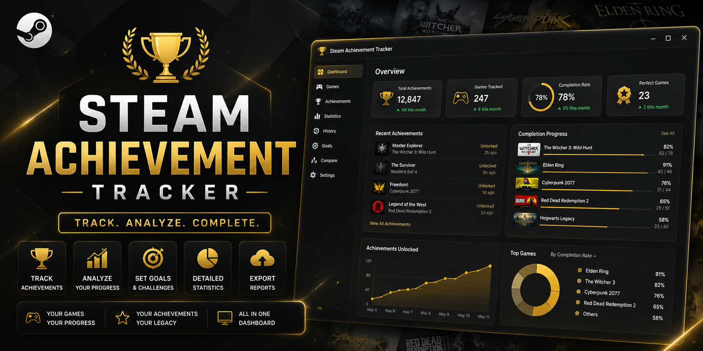
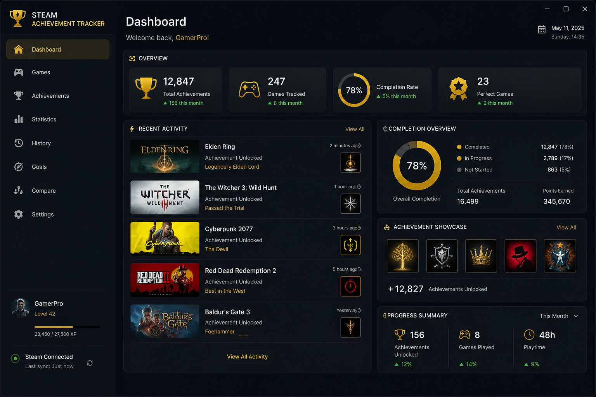
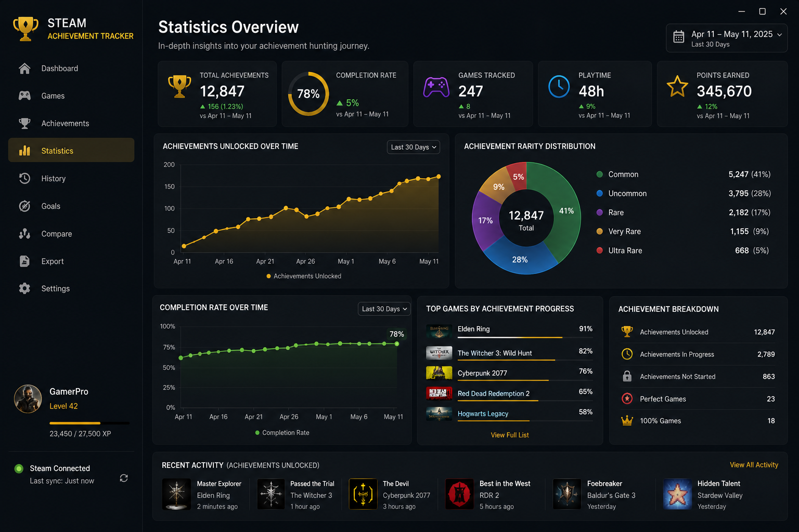

# Steam-Achievement-Tracker
Track Steam achievements, monitor game progress, view completion statistics, and manage your gaming goals from a modern desktop dashboard.
# Steam Achievement Tracker

<p align="center">
  
</p>

<h1 align="center">Steam Achievement Tracker</h1>

<p align="center">
  Track achievements, monitor completion rates, and analyze your Steam gaming progress.
</p>

<p align="center">
  
  
  
  
</p>

---

## Overview

Steam Achievement Tracker is a desktop utility designed for players who enjoy tracking their achievement progress across their Steam library.

View completion percentages, monitor recently unlocked achievements, analyze statistics, and set personal completion goals.

---

## Features

### Achievement Tracking

* Track unlocked achievements
* View achievement history
* Monitor completion rates
* Analyze game progress

### Statistics Dashboard

* Total achievements earned
* Completion percentage
* Most completed games
* Recent unlock activity

### Game Library Overview

* Browse tracked games
* Sort by completion rate
* View achievement summaries
* Quick progress review

### Reports

* Progress reports
* Achievement summaries
* Completion statistics
* Export support

---

## Screenshots

### Main Dashboard




### Statistics Overview



---

## Why Use Steam Achievement Tracker?

✔ Track gaming goals

✔ Improve completion rates

✔ Monitor achievement progress

✔ View detailed statistics

✔ Organize achievement history

✔ Analyze your Steam library

---

## Installation

1. Download the latest release.
2. Extract the ZIP archive.
3. Launch SteamAchievementTracker.exe.
4. Add your Steam profile.
5. Start tracking progress.

---

## Project Structure

```text
Steam-Achievement-Tracker
│
├── assets
│   ├── banner.png
│   ├── screenshot-1.png
│   ├── screenshot-2.png
│   └── screenshot-3.png
│
├── src
│   ├── AchievementTracker.cs
│   ├── StatisticsManager.cs
│   ├── ProgressAnalyzer.cs
│   └── ReportGenerator.cs
│
├── docs
│   ├── Installation.md
│   ├── FAQ.md
│   └── Roadmap.md
│
├── README.md
├── LICENSE
├── CHANGELOG.md
├── SECURITY.md
└── CONTRIBUTING.md
```

---

## Roadmap

### Version 1.1

* Achievement Categories
* Enhanced Statistics
* Improved Reports
* Faster Data Processing

### Version 1.2

* Achievement Comparison
* Favorite Games
* Progress Filters

### Version 2.0

* Cloud Synchronization
* Advanced Analytics
* Achievement Recommendations

---

## Release

Latest Release:

```text
Steam-Achievement-Tracker.zip
```

Executable:

```text
SteamAchievementTracker.exe
```

---

## License

Released under the MIT License.
